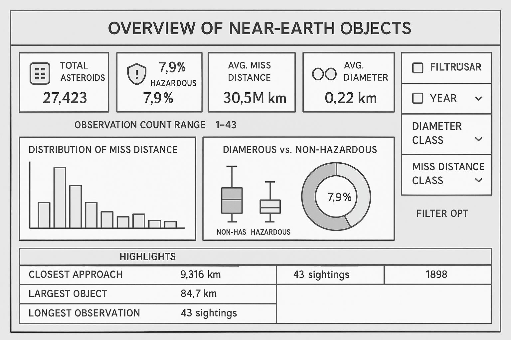
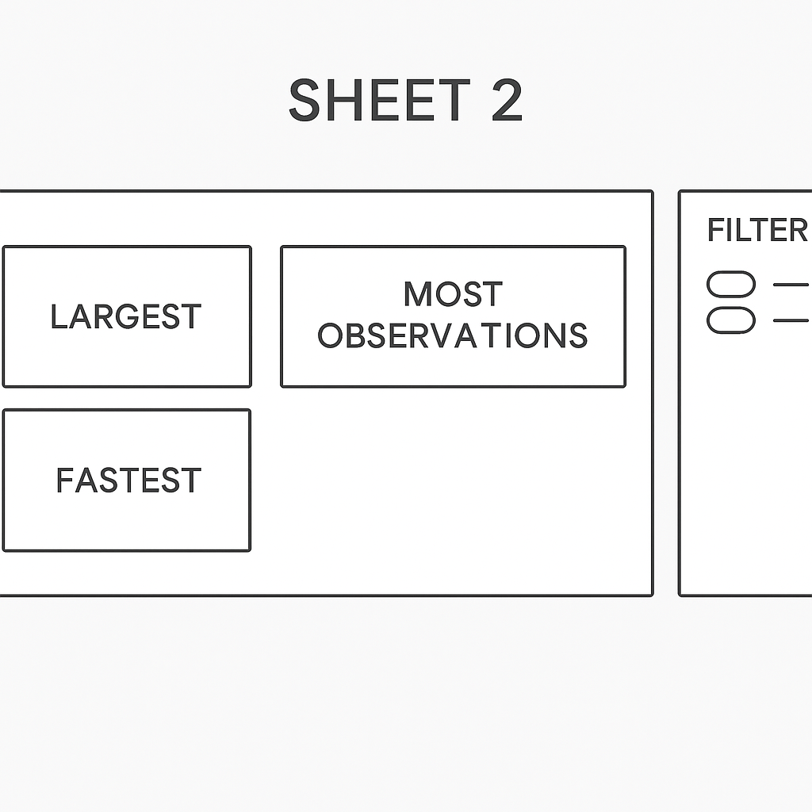
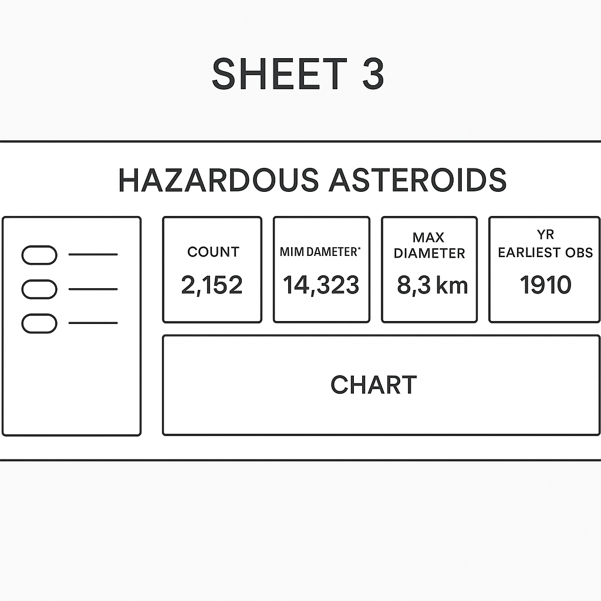
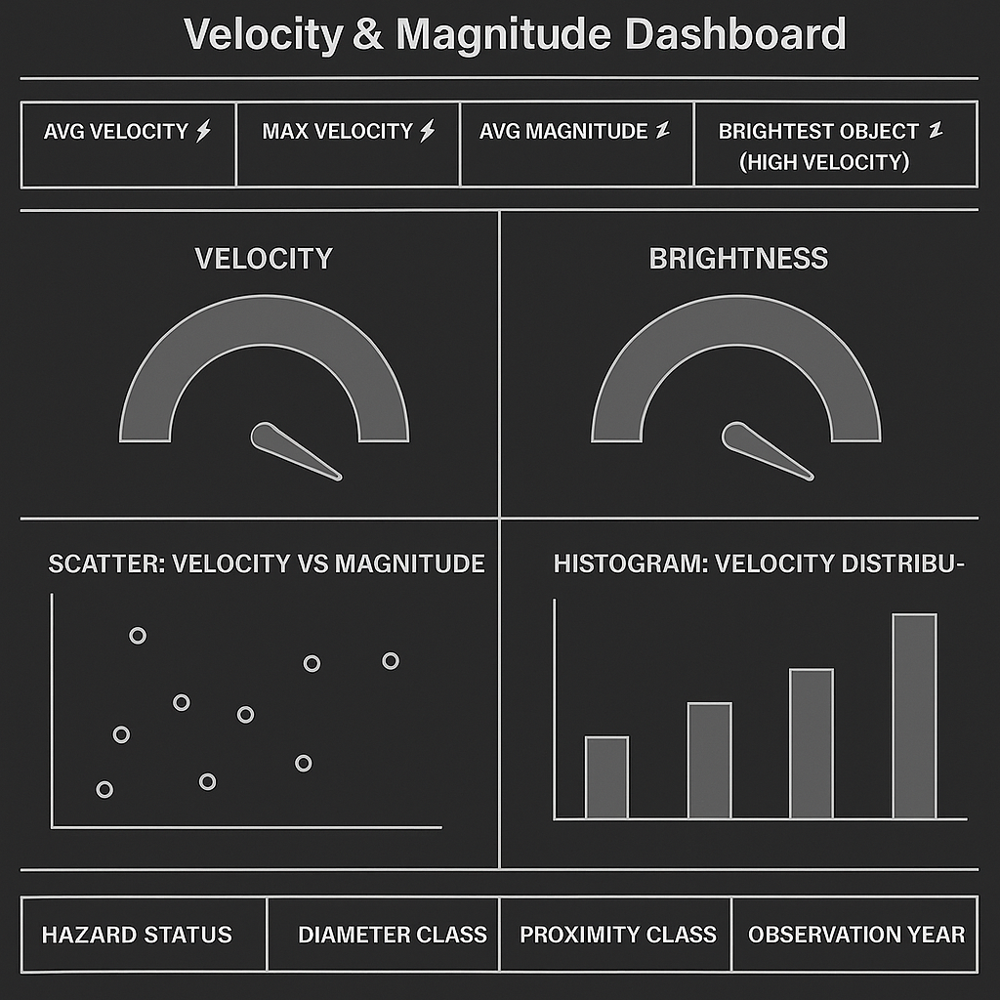
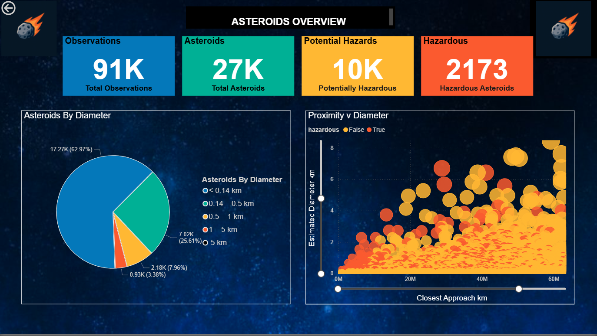
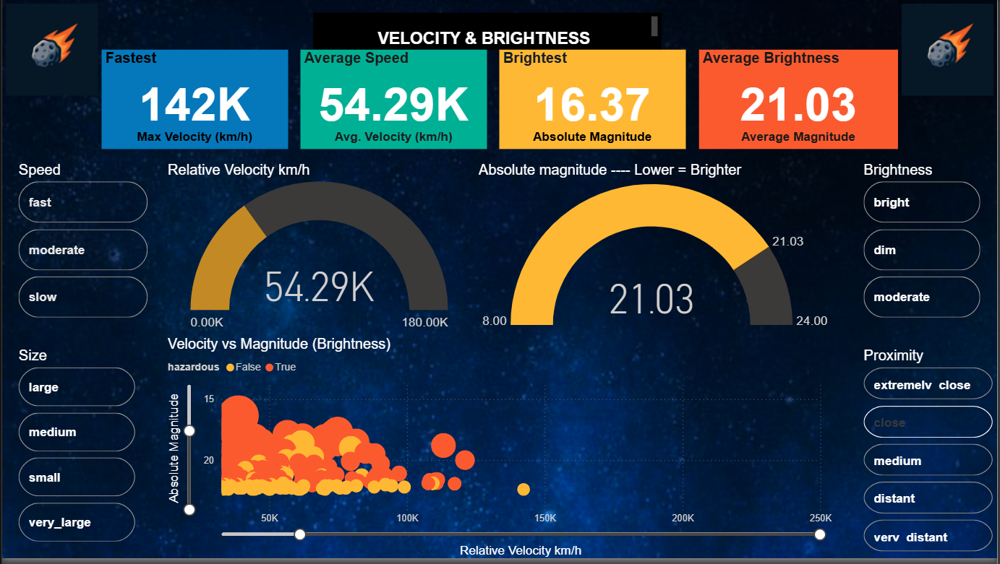
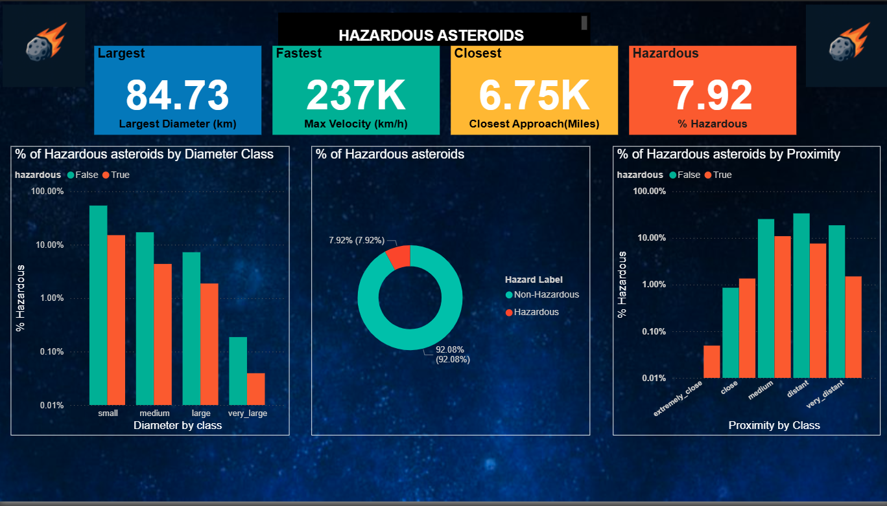

</td>
    

***
#  Near Earth Asteroid Analysis 🚀

## Table of Contents

  
Click to expand

- [1. Project Overview](#1-project-overview)
- [2. Dataset Content](#2-dataset-content)
- [3. Project Requirements](#3-project-requirements)
- [4. Hypothesis and Validation](#4-hypothesis-and-validation)
- [5. Project Plan](#5-project-plan)
- [6. Notebooks Description](#6-notebooks-description)
- [7. Mapping Project Requirements to Data Visualisations](#7-mapping-project-requirements-to-data-visualisations)
- [8. Analysis Techniques](#8-analysis-techniques)
- [9. Analysis & Conclusions](#9-analysis-conclusions)
- [10. Ethical considerations](#10-ethical-considerations)
- [11. Dashboard Design](#11-dashboard-design)
- [12. Unfixed Bugs](#12-unfixed-bugs)
- [13. Development Roadmap](#13-development-roadmap)
- [14. Glossary](#14-glossary)
- [15. Deployment](#15-deployment)
- [16. Main Data Analysis Libraries](#16-main-data-analysis-libraries)
- [17. Credits](#17-credits)
- [18. Acknowledgements](#18-acknowledgements)

## 1.  Project Overview

This project explores NASA’s Near-Earth Object (NEO) dataset, focusing on asteroids that come within close proximity to Earth.

Using publicly available data from NASA’s [JPL Center](https://www.jpl.nasa.gov/) for Near-Earth Object Studies (CNEOS) and a Kaggle mirror of the dataset, this analysis investigates the physical and orbital characteristics that influence whether an asteroid is classified as potentially hazardous.

To achieve this I use statistical tests and visualisations to examine the data, and Machine Learning techniques to investigate which properties are predictive of hazardous asteroids.
I will create detailed summaries outlining findings and produce a Power BI dashboard as a visual guide to the project and findings.

***

## 2. Dataset Content
* The dataset includes key attributes such as estimated diameter, relative velocity, miss distance, and absolute magnitude of over 27,000 asteroids with 90,000 observations.
Additional features have been added (based upon the original data). For example, the number of observations per object was engineered to capture tracking frequency and observation density.

### Columns in `Data/Raw/neo.csv` (source file)

- `id` — integer unique identifier for the NEO .
- `name` — object name or designation (string). Comprises an identifier and the year first observed.
- `est_diameter_min` — estimated minimum diameter (kilometres).
- `est_diameter_max` — estimated maximum diameter (kilometres).
- `relative_velocity` — relative approach velocity ( km/h).
- `miss_distance` — miss distance at close approach.
- `orbiting_body` — the body the object is approaching (`Earth`). 
- `sentry_object` — boolean indicating whether the object is listed on the [Sentry Risk Table](https://cneos.jpl.nasa.gov/sentry/).
- `absolute_magnitude` — absolute magnitude H (brightness; lower = brighter/larger).
- `hazardous` — boolean flag for potentially hazardous status (True/False).

### Transformed Columns

- `est_diameter_mean` — (min + max) / 2 — represents the best single-value estimate of asteroid size
- `diameter_range` — (max − min) — indicates uncertainty or shape variability
- `relative_velocity` (mean) — average relative velocity across observations
- `absolute_magnitude` (mean) — average magnitude across observations
- `observations` — aggregated for each object (range 1–43)

### Log-transformed columns (added to `Data/Processed/features.csv`)

To stabilise variance and reduce heavy right-skew in several distance/size/velocity columns, I added safe, non-destructive log transforms in the processed features file.
- `est_diameter_min_log1p`, `est_diameter_max_log1p` — log1p of original diameter bounds (km). Useful for plotting and linear-model inputs.
- `est_diameter_mean_log1p`, `est_diameter_range_log1p` — log1p of the derived mean and range of diameter; compresses extreme values and reduces the influence of large outliers.
- `relative_velocity_mean_log1p` — log1p of average relative approach velocity; helps visualisation and models when velocity varies across orders of magnitude.
- `miss_distance_mean_log1p`, `miss_distance_min_log1p` — log1p of miss distances to compress the very large distance scale and reveal structure at smaller scales.

### Encoded Features (added to `Data/Processed/features_model.csv`)

- `hazardous_enc` - encoded hazardous status (1 for True, 0 for False)
- `diameter_class`  — labels derived from est_diameter_mean (small, medium, large, very_large).
- `proximity_class` — labels derived from miss_distance_mean (extremely_close → very_distant).
- velocity_class  — labels derived from relative_velocity_mean encoded to speed bands (km/h).
- `brightness_class` — derived from absolute_magnitude_mean bins (brighter → dim). Mitigates inverted H scale and groups objects by observational brightness.
- `observation_class`  — derived from observations counts (single → extensive).
Rationale: compresses long-tailed counts into interpretable tracking-frequency classes.

- These transformed columns are kept alongside the originals so the most appropriate representation can be chosen for modelling or visualisation.

### Saved datasets

**Observations (observations.csv)**
Cleaned version of original dataset for use in the dashboard.

**Features (features.csv)**
Aggregated version of observations.csv with transformed features.
For use in the dashboard, statistical tests and visualisations.

**Modelled Features (features_model.csv)**
Based on the Features dataset with encoded columns for ML modelling.
For use in ML, visuals and dashboards.

*(Full details of datasets with data types saved to Data/Reports/feature_lists.md)*

## 3. Project Requirements

The requirements of the project are to:

* Identify potentially dangerous asteroids
    - Detail: Use the hazard flag and derived metrics (size, miss distance, velocity) to identify potentially hazardous objects.

* Investigate which physical properties contribute to hazardous status
    - Detail: Run hypothesis tests and simple predictive models to quantify how diameter, velocity and miss distance relate to the `hazardous` label. Include uncertainty estimates and effect sizes.
    
* Understanding these properties may help to mitigate the threats posed
    - Detail: Summarise practical implications of the findings (e.g., which features most strongly drive risk scores) and note limitations for operational use.
    

Hazardous asteroids may:
* Be a direct threat to Earth if large enough
    - Context: Large bodies with small miss distances present the highest theoretical risk; however, this project's size estimates are approximate and should be treated as indicative only.
   
* Disrupt communications and other satellites
    - Context: Objects that intersect LEO/GEO-altitude orbits are of interest for satellite operators. 

* Be a threat to other near earth objects e.g. space telescopes
    - Context: Secondary effects (debris, close passes) may pose risk to valuable space assets; this project only flags potential concerns for further study.
    

### Scope, audience, and disclaimer

- Purpose: This repository is a small, educational training project intended to demonstrate data engineering, exploratory analysis, and basic predictive modelling techniques using an open NEO dataset. It is not intended for operational, commercial, or scientific decision-making.
- Intended audience: students, data-science learners, and reviewers interested in reproducible analysis workflows.
- Non-operational disclaimer: analyses, visualisations, and models produced here are exploratory. They are not validated for policy, emergency response, or mission planning. Any real-world interpretation should rely on authoritative sources (e.g., NASA/JPL CNEOS) and domain expert review.
- Success criteria (project): reproducible ETL producing clean datasets, documented hypothesis tests and EDA, baseline model with evaluation metrics, and clear documentation (README, reports, ethics note).

## 4. Hypothesis and Validation

The hypotheses for this project are as follows:
* #### **Physical and Predictive Hypotheses** 
    * **Larger asteroids** (greater estimated diameters) are more likely to be classified as hazardous.
        * **Validation**
            1. Compare diameter distributions between hazardous vs non-hazardous objects with a boxplot / violin plot.
            2. Run a two-sample test (Mann–Whitney U if non-normal, t-test if approx normal) to check median/mean differences.
            3. Fit a simple logistic regression: is_hazardous ~ log(diameter). Check coefficient sign, p-value, and AUC.
        * **Supportive result**: Hazardous group has significantly larger diameters (p < 0.05) and positive diameter coefficient in logistic regression with meaningful effect size

    * **Closer approaches to Earth** (smaller miss distances) are associated with a higher likelihood of hazard classification.
        * **Validation**
            1. Visualize miss distance distributions by hazard status
            2. Use Mann–Whitney U or t-test for distance differences.
            3. Logistic regression
        * **Supportive result**: Hazardous asteroids concentrate at smaller miss distances (statistically significant) and miss_distance has a negative, significant logistic coefficient.

    * **Higher relative velocities** correlate with greater hazard potential (due to increased impact energy).
        * **Validation**
            1. Plot velocity distributions by hazard status.
            2. Statistical test (Mann–Whitney U / t-test).
            3. Logistic regression
        * **Supportive result**: Hazardous objects show significantly higher relative velocities
    * **Absolute magnitude** (brightness) inversely correlates with hazard level — brighter (larger) objects are more likely to be hazardous. 
        * **Validation**
            1. Visualize H by hazard status.
            2. Test difference with Mann–Whitney U / t-test.
            3. Logistic regression: hazardous ~ -absolute_magnitude (or use H and expect negative coefficient)
        * **Supportive result**: Supportive result: Hazardous asteroids have lower median H (statistical significance) and H coefficient indicates brighter objects increase hazard odds.

    * A combination of **size**, **speed**, and **miss distance** can effectively predict hazard status.
        * **Validation**
            1. Train a multivariate classifier (logistic regression, random forest, or XGBoost) using those features.
            2. Use cross-validation and report AUC, precision, recall, and calibration (reliability plot).
            3. Run ablation: compare model using all three vs models using subsets 
        * **Supportive result**: Multivariate model achieves substantially higher AUC (e.g., >0.80 if baseline is ~0.5–0.6) and ablation shows each feature contributes measurable lift.

* #### **Observational Hypotheses** 🔭
    * NEOs with more recorded **observations** tend to be closer and larger or brighter.
        * **Validation**
            1. Scatter plots: observation_count vs miss_distance and observation_count vs diameter (use log scales).
            2. Compute Spearman correlation (robust to nonlinearity) for observation_count with miss_distance and with diameter.
            3. Regress observation_count (or log count) on miss_distance and diameter to quantify effects.
        * **Supportive result**: Negative Spearman for observation_count vs miss_distance, positive Spearman vs diameter (both significant).

    * **Potentially hazardous asteroids** are observed more frequently due to higher monitoring priority.
        * **Validation**
            1. Compare observation_count distributions by hazard status (boxplot/histogram).
            2. Mann–Whitney U / t-test to check difference.
            3. Poisson or negative binomial regression: observation_count ~ is_hazardous + controls (e.g., discovery_year) to estimate incidence rate ratio..
        * **Supportive result**: Hazardous objects have higher median observation counts and hazard indicator has a positive, significant rate ratio.

## 5. Project Plan

This project plan maps work into clear phases, links each phase to the notebooks and files in this repository, and lists deliverables and acceptance criteria so progress can be tracked against the project board.

### Phases & mapping

- Phase 1 — Data collection & ETL
    - Files / notebooks: `jupyter_notebooks/ETL.ipynb`, `Data/Raw/neo.csv`
    - Tasks: confirm data provenance, standardise types and units, impute or document missing values, engineer base features, and write versioned processed outputs to `Data/Processed/`.
    - Deliverables: `Data/Processed/neo_clean.csv`, `Data/Processed/features.csv`.
    - Acceptance criteria: raw file backed up, processed files produced.

- Phase 2 — Exploratory Data Analysis (EDA)
    - Files / notebooks:  `Jupyter_notebooks/Visualisation.ipynb` (EDA & Visualisations/statistical tests)
    - Tasks: visualise distributions, test primary hypotheses (see Hypotheses section), and produce figures for the dashboard.
    - Deliverables: EDA notebooks with plots, summary figures saved to  and a short findings section.
    - Acceptance criteria: figures are reproducible from processed data and include captions, axes, and uncertainty where relevant.

- Phase 3 — Modelling & validation
    - Files / notebooks: `jupyter_notebooks/Modelling.ipynb`
    - Tasks: build predictive models (logistic regression, random forest), evaluate via cross-validation, and produce model diagnostics and calibration plots.
    - Deliverables: model notebook, evaluation metrics and an explanation of  model limitations.
    - Acceptance criteria: model reproducibility, stratified CV reported.

- Phase 4 — Dashboard & visual story
    - Files / notebooks: `jupyter_notebooks/Visualisation.ipynb`, `dashboard/` (if created)
    - Tasks: design user-facing visualisations to communicate key insights for technical and non-technical audiences, prepare narrative and captions.
    - Deliverables: interactive dashboard or static figure set, README instructions for running the dashboard.
    - Acceptance criteria: visuals annotated, accessible (alt text), and tested.

- Phase 5 — Documentation & Deployment
    - Files: `README.md`, Jupyter Notebooks (`ETL.ipynb`,`Visualisation.ipynb`,`Modelling.ipynb`) and a dashboard  for deployment
    - Tasks: finalize documentation and deploy (optional) to Heroku/ PowerBI or other platform.
    - Deliverables: polished README  and working deployment instructions.
    - Acceptance criteria: repository is self-contained for a reviewer to reproduce the main result following the README.

### Timeline & milestones

- Milestone 1: ETL complete and processed datasets available (linked on project board).
- Milestone 2: EDA visualisations and hypothesis tests complete.
- Milestone 3: Baseline predictive model built and validated.
- Milestone 4: Dashboard / visual story prepared and documented.
- Milestone 5: Final report, ethics note, and deployment documentation completed.

## 6. Notebooks Description

Below are concise objectives for the Jupyter notebooks in this repository. Notebooks are listed in order to show workflow.

- 1. `jupyter_notebooks/ETL.ipynb`
    - Purpose: load raw observation-level data, standardise types/units, and produce object-level dataset used by downstream analysis.
    - Key steps:
        - Read `Data/Raw/neo.csv`, validate schema and units.
        - Clean, evaluate numeric types, and aggregate observations to object-level features.
        - Add non-destructive transforms (log1p columns) and export `Data/Processed/features.csv` and `Data/Processed/observations.csv`.
    - Outputs: processed CSVs, simple data-quality diagnostics, and ETL provenance notes.

- 2. `jupyter_notebooks/Visualisation.ipynb`
    - Purpose: perform focused exploratory data analysis and statistical tests that validate the project hypotheses and generate visuals related to hypothesis/ project requirements.
    - Key steps:
        - Load `Data/Processed/features.csv` and reproduce summary statistics.
        - Produce distribution plots (raw + log), box/violin comparisons by `hazardous`, correlation heatmaps and hypothesis tests (e.g., Mann–Whitney U).
    - Outputs: EDA figures, hypothesis test tables, and a short findings summary.
    
 - 3. `jupyter_notebooks/Modelling.ipynb`
    - Key Steps:
        - Create a dataset ready for ML modelling and the dashboard by filtering and rebalancing observations, and by creating derived/binned classes for very skewed features.
        - Remove very small non-hazardous asteroids, introduce binned classes for diameter/proximity/velocity where useful, and save the model-ready dataset.
    - Inputs:
        - `Data/Processed/features.csv` (with guidance from the Visualisation notebook conclusions); notes on thresholds/bins and any ETL adjustments.
    - Outputs:
        - A model-ready dataset (saved as `Data/Processed/features_model.csv` — referenced in notebook as `features_modelled.csv`), new binned/class features for key variables, and brief diagnostics showing improved balance for modelling.
        - Note: Originally intended to do ML Modelling in this notebook, but decided to move to new notebook for clarity (see below)

 - 4. `jupyter_notebooks/ML_Modelling.ipynb`
    - Purpose: train and evaluate tree‑based classifiers (Random Forest, Decision Tree, Extra Trees) to predict hazardous status using the model‑ready dataset.
    - Inputs: `Data/Processed/features_model.csv` (binned classes and selected features from `Modelling.ipynb`).
    - Key steps: build pipelines with imputation and ordinal encoding, run baseline training, evaluate with accuracy/ROC‑AUC/PR‑AUC, and perform GridSearchCV tuned for recall.
    - Outputs: comparison table of models, confusion matrices, tuned model pipelines, feature‑importance summaries and plots.
    - Notes: Grid search can be long-running; notebook emphasises recall (safety‑first) and documents reproducibility steps (working directory and seed).

## 7. Mapping Project Requirements to Data Visualisations

* Identify potentially dangerous asteroids → scatter plot (est_diameter vs miss_distance) coloured by hazardous — quickly highlights large objects with close approaches.
* Investigate physical drivers → side‑by‑side box/violin plots for diameter, velocity and magnitude by hazardous — compares distributions and effect sizes.
* Quantify observation patterns → log‑scaled scatter / heatmap of observations vs miss_distance and diameter — reveals monitoring bias and correlation.
* Evaluate predictive models → ROC/PR curves plus confusion matrix and feature‑importance bar chart — shows classifier performance and top predictors.
* Stakeholder summary & drilldown → KPI cards + interactive filters (date, size, proximity) — enables fast insight and targeted investigation.

## 8. Analysis Techniques
### Summary and Alternatives

 **Data cleaning & ETL**
- Standardisation & type coercion
  - Action: convert columns to numeric types, normalise units (kilometres, km/h), a
  - Alternatives: schema-first validation (e.g., `pandera`, `pydantic`). Trade-off: stricter validation but more upfront schema work.
- Aggregation
  - What: group observation-level rows by `name` and aggregate into object-level features (means, minima, counts).
  - Why: modelling and many EDA steps require one row per object; aggregation reduces noise from repeated measurements.
  - Alternatives: hierarchical models or mixed-effects models that retain per-observation data and model within-object variation; trade-off: increased model complexity and runtime.

**Feature engineering**
- Log1p transforms for skewed variables
  - Action: non-destructive log1p columns for diameter, miss distance and velocity.
  - Why: reduces right skew, improves visualization and linear-model assumptions.
  - Alternatives: Box–Cox or Yeo–Johnson transforms, robust scaling (e.g., quantile transforms) when distributions vary.
- Derived features and bins
  - What: `est_diameter_mean`, `diameter_range`, binned classes for diameter/proximity/velocity/brightness/observations.
  - Why: creates interpretable features for tree models and dashboards.
  - Alternatives: continuous modelling of data.

**Exploratory Data Analysis (EDA)**
- Visual diagnostics
  - What: histograms, KDEs, boxplots/violin plots, scatterplots (log-scaled where helpful), and heatmaps for correlations.
  - Why: reveal distributional differences and relationships before modelling.
  - Alternatives: interactive dashboards for richer exploration.
- Statistical hypothesis testing
  - What: Mann–Whitney U tests for non-normal two-sample comparisons, Spearman correlations for monotonic relationships.
  - Why: robust to non-normality and outliers common in astronomical data.
  - Alternatives: parametric t-tests when normality is reasonable, permutation tests for exact p-values, or Bayesian comparisons.

**Modelling**
- Baseline and tree-based models
  - What: Decision Tree, Random Forest, Extra Trees as baseline/interpretable ensembles.
  - Why: handle mixed data types, require little preprocessing for non-linear relationships, and provide feature importance.
  - Alternatives: Logistic regression (simple, interpretable), XGBoost / LightGBM (often higher accuracy, more tuning) - planned for future development.
- Pipeline & preprocessing
  - What: scikit-learn Pipelines with imputation, scaling/encoding and model estimator; GridSearchCV for hyperparameter tuning.
  - Why: reproducible workflows and safe parameter estimation with cross-validation.
  - Alternatives:RandomizedSearchCV for more efficient hyperparameter search, or nested CV for more robust performance estimates. (beyond project scope and resources atm)
- Class imbalance handling
  - What: focus on recall for `hazardous` class; tuning and class weights used to prioritise sensitivity.
  - Why: missing a hazardous object is costlier than a false positive in this context.
  - Alternatives: resampling.

**Evaluation & interpretation**
- Metrics
  - What: ROC‑AUC, Precision-Recall AUC, confusion matrices, recall-focused thresholds.
  - Why: ROC gives an overall ranking metric, PR-AUC highlights performance on imbalanced positive class.
  - Alternatives: F1 score for balance, or domain-specific utility/cost functions when the operational cost of errors is known.
- Explainability
  - What: global feature importance for tree models and partial dependence plots for top features.
  - Why: provides interpretable signals for domain experts and stakeholders.
  - Alternatives: SHAP or LIME for local and global explanations.

**Reporting & Dashboarding**
- Static & interactive outputs
  - What: static PNG/SVG figures for reports and an interactive dashboard (Power BI / Plotly Dash) for exploration.
  - Why: static figures are reproducible in reports; interactive dashboards enable ad-hoc exploration.
  - Alternatives: Streamlit. Tableau or Voila.

**Reproducibility**
- Environment & dependencies
  - What: pinned requirements file and documented notebooks with seed settings and working-directory notes.
  - Why: reproducible results across environments.
  - Alternatives: containerisation (Docker) or environment managers (conda, pip-tools).

---
## 9. Analysis & Conclusions

* I structured the analysis by examining hypothesis individually and providing representations which aligned with the project goals. I found this to be an iterative process, with analysis leading to re evaluation.

* The Data became much more complicated than was needed - partially due to need to balance very skewed data while keeping representation of important features - in retrospect, though this was missing key aspects important to the main project goal - i.e. Predicting Hazardous Asteroids.
An example would be better and more detailed orbital data. I feel this was the most important take away from building this project.

* I used Generative AI mostly as a sounding board for ideas, helping with planning the project and summarising documentation in a form that I could then edit (AI tends to very verbose!). For code I mostly used autocompletion. During the ML phase I used AI to help suggest parameter lists for models and for editing more complex code blocks.

## 10. Ethical considerations
* Privacy and personal data
    * The dataset is astronomical and does not contain personal data.
    * There are few ethical or societal issues regarding this project.
    * Legal and ethical considerations would be covered by the [Space Treaty](https://www.unoosa.org/oosa/en/ourwork/spacelaw/treaties/introouterspacetreaty.html) under the governance of the UN.
* Dual use and misuse
    * Near-Earth object (NEO) analysis could inform planetary defence policy or, in theory, be misused in other contexts - e.g. exploitation of resources, misinformation regarding threat (sensationalism).
However, this project is an exploration of already existing and publicly available data and is unlikely to pose any ethical issues.
----

## 11. Dashboard Design

### Dashboard wireframes (brief)

Below are four concise wireframes for a compact dashboard. These are a selection of wireframe images outlining inital plans, intended charts and widgets.

#### Wireframe Dashboard Designs

 

 

(Note: Wireframe images created by generative AI with detailed prompts)

#### Colour Guide/ Design Guide

  

- Navy dark colours for backgrounds
- Background Canvas image possibly
- Space/ asteroid themed icons/ logo

(Note: Wireframe images created by generative AI with detailed prompts)

### Dashboard Details

**Dashboard 1 - Overview**
---

- Purpose: At-a-glance summary of the dataset.
    - Main widgets:
        - Header with project title.
        - KPI cards: Total Observations, Total NEOs, Potentially Hazardous (PHA), Hazardous Asteroids
    - Charts 
        - Pie Chart showing diameter distributions
        - Scatter plot with sliders showing close approaches and diameter
    - Interactions: Click a row to filter for different parameters.
        - Clicking Pie chart segment changes KPI for hazardous asteroids
        - Scatter plot has sliders to zoom in for close approaches and diameter
        - Scatter plot has hover data shows asteroid statistics.
        (varies from wireframe)
  

     
**Dashboard 1 - Velocity & Brightness**
---

- Purpose: Inspect Velocity & Magnitude(Brightness).
    - Main widgets:
        - Header with title.
        - KPI cards: Max Velocity, Max Brightness, Asteroids, Hazardous Asteroids
    - Charts 
        - Speed Gauges for Velocity and Magnitude
        - Scatter plot with sliders showing Velocity and Magnitude
        - Sliders to toggle categories for Diameter, Proximity, Velocity & Brightness
        - Scatter plot has sliders to zoom in for close approaches and diameter
        - Scatter plot has hover data shows asteroid statistics.
        - To Do - Attempted to add reset button for sliders - removed as not working
        (varies from wireframe)
  

3) Hazardous Asteroids

    - Purpose: Display key stats re hazardous asteroids.
     - Main widgets:
         - Summary - key stats
         - Largest, closest, fastest hazards - density at different sizes
         - Pie chart
         - Average stats for hazardous objects
     - Interactions: Did not have time to complete interactions. 
  

4) Models & Evaluation - NOT COMPLETED

    - Purpose: Present modelling approach, key metrics, and diagnostics used to predict `hazardous`.
     - Main widgets:
         - Model summary card (type, train/test split, features used, date trained).
         - Performance plots: ROC curve, Precision-Recall curve, confusion matrix, calibration plot.
         - Feature importance bar chart (global) and partial dependence / ICE for top 3 features.
         - Toggle to view model behaviour under alternate class-weighting or threshold.
     - Interactions: Slider to adjust classification threshold and view resulting precision/recall; dropdown to switch model versions.
     
     
5) Storyboard Dash
    - Purpose: Give a non-technical overview.
     - Main widgets:
         - Yet to be decided
     

## 12. Unfixed Bugs
* Small issues with dashboard slicers not unselecting - tried to create resest button with guide but this did not have desired effect 
* Slug file for heroku slightly too large so not dislaying atm - have deployed to powerbi instead

## 13. Development Roadmap

* The most difficult problems I faced were how to handle the data and how best to represent it:
    * The data covered multiple observations of numerous asteroids
    * How to aggregate while still retaining important information was a key consideration
    * The initial dataset contained information on numerous asteroids that were not potentially harmful (too small)
    * This required a secondary data cleaning/pruning process after the initial ETL phase (with hindsight this could have been picked up earlier)
    * This caused a knock-on effect of pushing back the ML and dashboard phases of the project
    * The lack of extensive orbital data also caused some problems in modelling as did the use of inverted scales for some data
    

* What new skills or tools do you plan to learn next based on your project experience?
    * I concentrated upon using Tree models for this project - the next obvious step is to use logistic regression either with the same data or with more detailed data.
    * To investigate and become proficient in more Python data-analytics and ML libraries
    * To explore more data analysis & ML techniques
    * To improve understanding of statistical analysis

## 14. Glossary

* **neo** - near earth object, classified as an object which can pass within 45m km of the earth's orbit
* **h** -  Absolute Magnitude, scale direction: lower H = brighter/larger
* **GEO** -  Geostationary Equatorial Orbit
* **LEO** - Low Earth Orbit
* **AU** - Astronomical Unit - based upon the earth's average distance from the sun (roughly 150m km)
* **pha** - Potentially Hazardous Asteroid
* **albedo** - A measure of reflectivity - asteroids are often classified using this.
* **JPL** - NASA Jet Propulsion Lab

## 15. Deployment

### Heroku

* The App live link is: [Heroku](https://dashboard.heroku.com/apps/near-earth-asteroid-analysis)  - to be redeployed with streamlit dashboard

### Power BI

* Dashboard viewable at: [Power BI](https://app.powerbi.com/groups/me/reports/24965605-13bd-4e4e-9821-16f910b4ff03/cd305fabcc9099209731?experience=power-bi) - 0rginal licence expired (to be redeployed once new licence is available)

## 16. Main Data Analysis Libraries

 pandas
  - Where used: All notebooks.
  - Purpose: primary data loading, DataFrame manipulation, grouping/aggregation, I/O , basic summary tables.

- numpy
  - Where used: All notebooks.
  - Purpose: numeric operations, log1p transforms, arrays and numeric helpers.

- matplotlib (matplotlib.pyplot as plt)
  - Where used: ETL, Visualisation, Modelling, ML_Modelling.
  - Purpose: static plotting (histograms, boxplots, violin plots, scatterplots, confusion matrix plotting wrappers).

- seaborn
  - Where used: ETL, Visualisation, Modelling, ML_Modelling.
  - Purpose: higher-level plotting: histplots, violin/boxplots, KDE plots, scatterplots with styling.

- plotly (plotly.express as px)
  - Where used: Visualisation, Modelling, ML_Modelling.
  - Purpose: interactive visualisations (parallel coordinates, interactive scatter). 

- warnings
  - Where used: Visualisation, Modelling, ML_Modelling.
  - Purpose: suppress non-essential warnings.

- ydata_profiling (ProfileReport)
  - Where used: ETL.ipynb.
  - Purpose: generate an initial profiling report (ydata_profiling.ProfileReport) saved to `Data/Reports/neo_profile_report.html`.

- pingouin (pg)
  - Where used: Visualisation.ipynb.
  - Purpose: normality checks.

- scipy.stats
  - Where used: Visualisation, Modelling, ML_Modelling.
  - Purpose: statistical tests and correlation functions (mannwhitneyu, spearmanr, ttest_ind). 

- sklearn (scikit-learn)
  - Where used: Modelling.ipynb, ML_Modelling.ipynb, Visualisation.ipynb (light usage/import in EDA).
  - Purpose: model selection (train_test_split, GridSearchCV, StratifiedKFold), model classes (DecisionTreeClassifier, RandomForestClassifier, ExtraTreesClassifier), pipelines, preprocessing (KBinsDiscretizer), metrics, confusion matrix plotting, and model evaluation.

- feature_engine
  - Where used: Modelling / ML_Modelling pipelines.
  - Purpose: imputation (MeanMedianImputer, CategoricalImputer) and encoding (OrdinalEncoder) inside sklearn pipelines.

- pandas styling / display options
  - Where used: notebooks to adjust display settings for readability.

*Full technical details saved to Data/Reports/technical_report.md and Data/Reports/technical_info_detailed.md*

## 17. Credits 

### Content 

* I used chatGPT extensively as a sounding board for ideas, hypothesis generation, to clarify my understanding of some workflows and processes - particulary for ML and to generate/ edit some code snippets (though these I generally edited myself)

* I used copilot to generate reports, adding summaries to README which I could then edit and for limited error checking.
  I used it to autocomplete code (though often had to revise suggestions). I avoided using it for code generation and suggestions, as I find it often misses context and will edit existing code where it is not needed or suggests over-verbose code

* I used several datasets and websites to gain a better understanding of concepts and terminology.
    * [Dataset used](https://www.kaggle.com/datasets/sameepvani/nasa-nearest-earth-objects)
    * Original planned [dataset](https://www.kaggle.com/datasets/sakhawat18/asteroid-dataset)
    * Data used to understand [domain](https://www.kaggle.com/datasets/imtkaggleteam/nasa-neo-earth-close-approaches)
    * Data used to understand [domain](https://www.kaggle.com/datasets/basu369victor/prediction-of-asteroid-diameter)
    * Nasa for various aspects of domain knowledgehttps://www.nasa.gov/

  * UK English spellings used throughout

### Media

- Icons and logo images (other than CodeInstitute logo) were generated by ChatGPT

## 18. Acknowledgements 

* Thanks to Vasi and everyone at Code Institute for support & guidance.
* Thanks to my CI cohort

[acknowledgements]: #acknowledgements